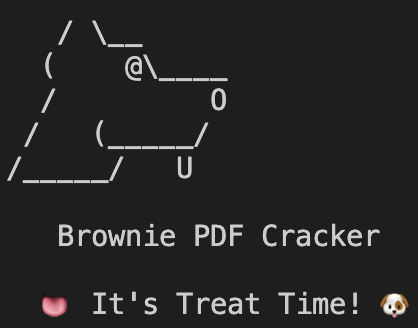

[](https://github.com/yanivsetton/brownie_pdf_cracker/actions/workflows/rust.yml)
# Brownie PDF Cracker

Brownie PDF Cracker is a command-line tool for cracking password-protected PDF files. It provides a flexible and efficient way to recover passwords for PDF documents, whether you've forgotten the password to your own PDF or need to perform a security assessment.

### Yaniv's Magic Mode

**Yaniv's Magic Mode** is a powerful and innovative approach to PDF password cracking that eliminates the need for a predefined wordlist or extensive knowledge about the password. This mode is ideal for users seeking an easy and effective way to crack PDF passwords without the hassle of managing wordlists.

#### How It Works

1. **Password Length Customization**: When you activate Yaniv's Magic Mode, the tool prompts you to specify the desired password length. This customization allows you to focus on cracking passwords of a specific length, making the process more efficient.

2. **Intelligent Password Generation**: Yaniv's Magic Mode employs an intelligent algorithm to generate passwords of the specified length systematically. It covers all possible combinations, ensuring comprehensive password testing.

3. **Efficiency and Speed**: By concentrating exclusively on passwords of the chosen length, Yaniv's Magic Mode dramatically reduces the time required to crack a PDF. It skips unnecessary iterations, making it one of the fastest ways to recover a PDF password.

4. **No Wordlist Required**: Unlike traditional methods that rely on wordlists, Yaniv's Magic Mode does not need any external files. This means you can start cracking PDF passwords immediately, even when you have limited information about the password.

**Yaniv's Magic Mode** is your go-to choice when you need to crack PDF passwords quickly and effectively, especially when you don't have access to a wordlist. It simplifies the process, making it accessible to users of all skill levels, and can significantly reduce the time required to regain access to your PDF documents.

To use Yaniv's Magic Mode:

```bash
$ ./brownie-pdf-cracker --pdf path/to/encrypted.pdf --yaniv-magic
```



## Table of Contents

- [Brownie PDF Cracker](#brownie-pdf-cracker)
    - [Yaniv's Magic Mode](#yanivs-magic-mode)
      - [How It Works](#how-it-works)
  - [Table of Contents](#table-of-contents)
  - [About](#about)
  - [Features](#features)
  - [Getting Started](#getting-started)
    - [Prerequisites](#prerequisites)
    - [Installation](#installation)
  - [How to use](#how-to-use)
    - [Numeric Passwords](#numeric-passwords)
    - [Wordlist Passwords](#wordlist-passwords)
    - [Yaniv's Magic Mode](#yanivs-magic-mode-1)
    - [For more information and additional options, use the --help flag:](#for-more-information-and-additional-options-use-the---help-flag)
    - [Contributing](#contributing)
    - [License](#license)

## About

Brownie PDF Cracker is a Rust-based tool designed to help you regain access to password-protected PDF files. Whether you've lost your PDF password or need to test the security of your PDF documents, this tool provides the capability to efficiently crack PDF passwords.

## Features

- Password cracking for PDF files.
- Numeric and wordlist-based password generation.
- Yaniv's magic password cracking mode.
- Progress tracking with a customizable progress bar.
- Command-line interface for easy usage.

## Getting Started

Follow these instructions to get Brownie PDF Cracker up and running on your system.

### Prerequisites

To run Brownie PDF Cracker, you'll need the following:

- [Rust](https://www.rust-lang.org/tools/install) installed on your system.

### Installation
Clone the repository to your local machine:

```bash
git clone https://github.com/yanivsetton/brownie_pdf_cracker/tree/main
cd brownie-pdf-cracker
cargo build --release
```
## How to use
```bash
Usage: brownie_pdf_cracker [OPTIONS] --pdf <PDF>

Options:
  -p, --pdf <PDF>
          Path to a password protected PDF file
  -y, --yaniv-magic specify password length and let the magic begin
  -w, --wordlist <WORDLIST>
          Path to a wordlist. Each word should be on a new line
  -i, --is-numeric
          Whether or not the password is entirely numeric
  -s, --smallest-numeric-length <SMALLEST_NUMERIC_LENGTH>
          Minimum length of numeric password [default: 1]
  -l, --largest-numeric-length <LARGEST_NUMERIC_LENGTH>
          Maximum length of numeric password [default: 8]
  -h, --help
          Print help
  -V, --version
          Print version
```

### Numeric Passwords
```
./brownie_pdf_cracker --pdf path/to/encrypted.pdf --is-numeric --smallest-numeric-length 4 --largest-numeric-length 6
```

### Wordlist Passwords
Test passwords from a wordlist file.
```
./brownie_pdf_cracker --pdf path/to/encrypted.pdf --wordlist path/to/wordlist.txt
```

### Yaniv's Magic Mode
Activate Yaniv's magic password cracking mode. This mode prompts you to enter the password length and then generates and tests passwords of that length.
```
./brownie_pdf_cracker --pdf path/to/encrypted.pdf --yaniv-magic
```

### For more information and additional options, use the --help flag:
```
./brownie_pdf_cracker --help
```

### Contributing
Contributions to Brownie PDF Cracker are welcome! Whether you want to report a bug, suggest a new feature, or contribute code, please refer to the Contribution Guidelines for details on how to get involved.

### License
This project is licensed under the MIT License.


This project was cloned from git@github.com:WarrenHood/crackify.git
as a base code
